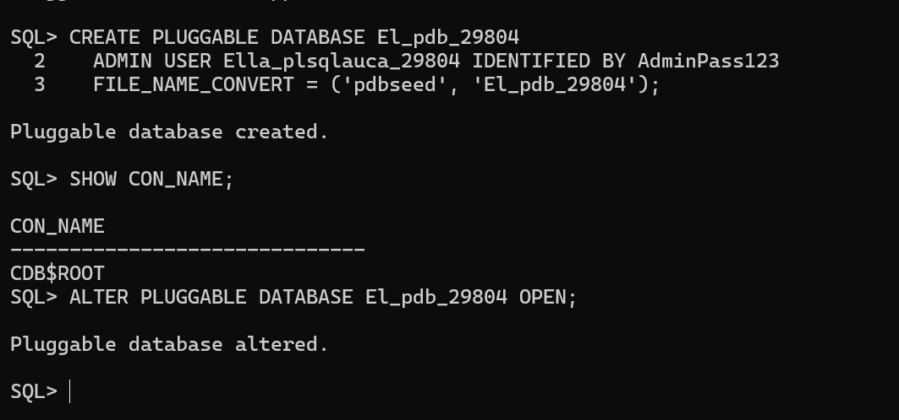
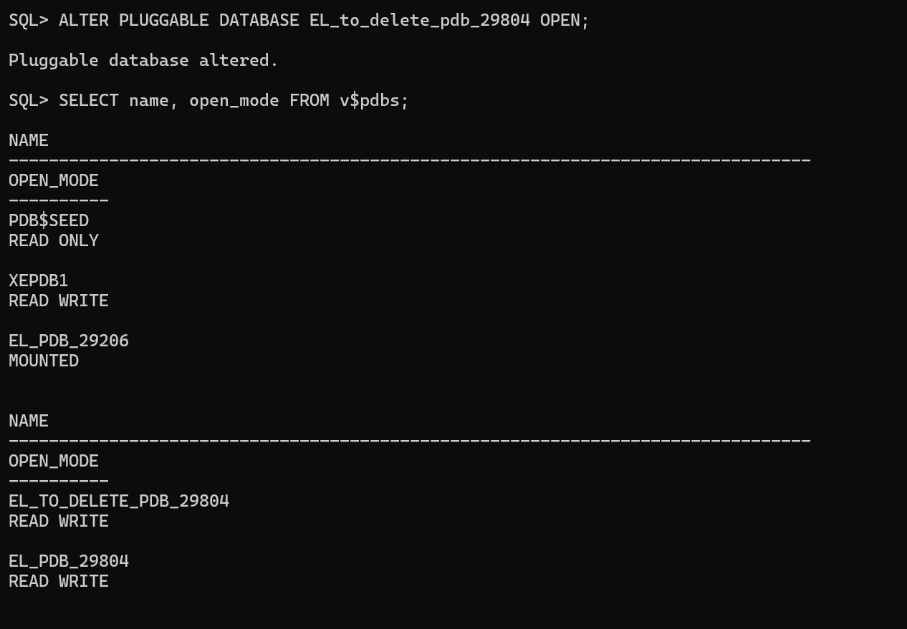
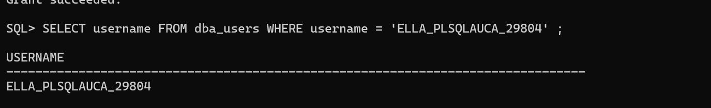
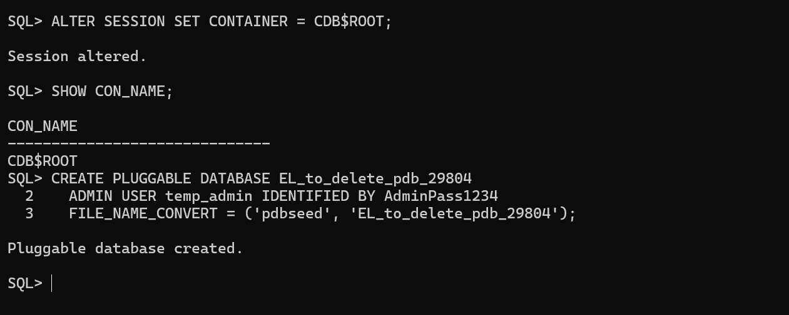
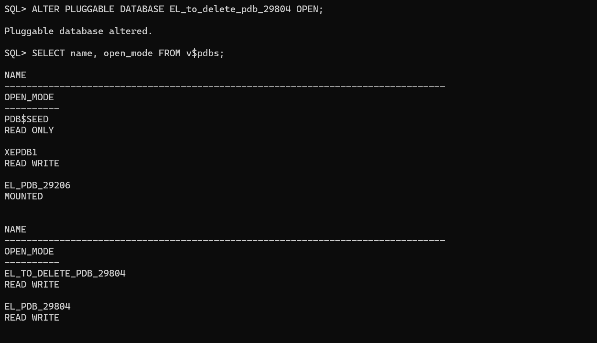
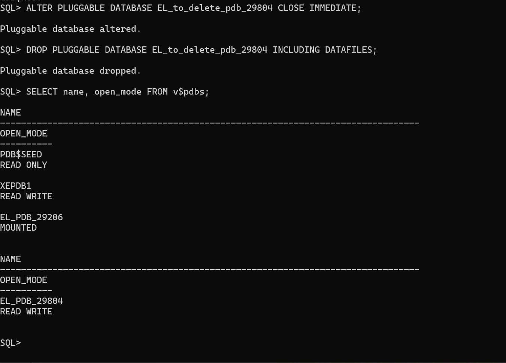
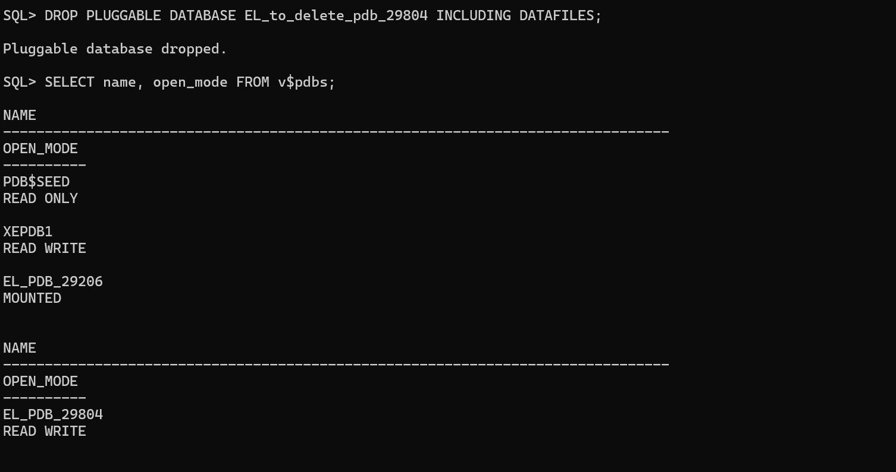
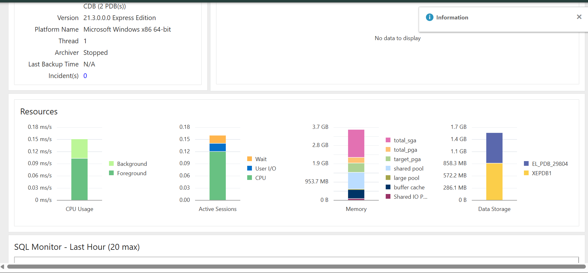
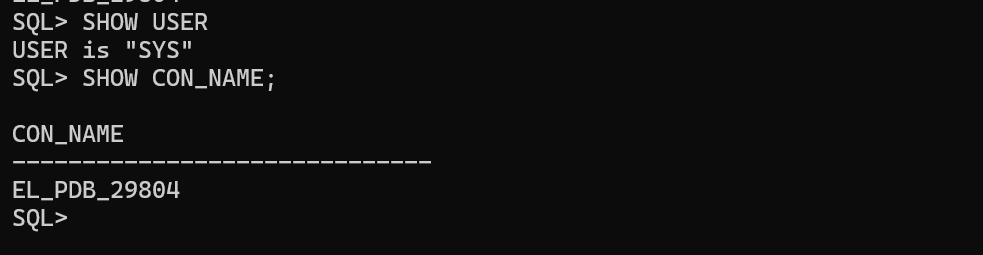

# Oracle PDB Management Assignment

## Student Information
- **Name:** Ella Ihimbazwe
- **Student ID:** 29804
- **Course:** INSY 8311 - Database Development with PL/SQL
- **Date:** September 22, 2026

---

## Overview

Hands-on Oracle Multitenant Architecture assignment demonstrating PDB creation, deletion, user management, and OEM dashboard access.

---

## Oracle Environment
- **Database:** Oracle 21c Express Edition (21.3.0.0.0)
- **OS:** Window 11
- **Tools:** SQL*Plus, Oracle Enterprise Manager

---

## Task 1: Create Main PDB

**PDB Created:** `[EL_pdb_29804]`  
**Username:** `[ELLA_PLSQLAUCA_29804]`

**Commands:**
```sql
CREATE PLUGGABLE DATABASE [pdb_EL_pdb_29804]
ADMIN USER [ELLA_PLSQL_29804] IDENTIFIED BY [12345]
FILE_NAME_CONVERT = ('pdbseed', '[pdb_EL_pdb_29804]');

ALTER PLUGGABLE DATABASE [pdb_EL_pdb_29804] OPEN;
GRANT CONNECT, RESOURCE, DBA TO [ELLA_PLSQL_29804];
```

**Evidence:** Screenshots show PDB creation, open state (READ WRITE), and user verification.





---

## Task 2: Create and Delete Temporary PDB

**Temp PDB:** `[EL_temp_pdb_29804]`

**Commands:**
```sql
CREATE PLUGGABLE DATABASE [EL_pdb_29804]
ADMIN USER EL_pdb_29804 IDENTIFIED BY 12345
FILE_NAME_CONVERT = ('pdbseed', '[EL_pdb_29804]');

ALTER PLUGGABLE DATABASE [EL_pdb_29804] CLOSE IMMEDIATE;
DROP PLUGGABLE DATABASE [EL_pdb_29804] INCLUDING DATAFILES;
```

**Evidence:** Screenshots show creation, both PDBs existing, deletion, and verification.






## Task 3: Oracle Enterprise Manager

**Access:** https://localhost:5500/em (SYS as SYSDBA)

**Evidence:** OEM dashboard screenshot showing PDB status and username.



---

## Challenges and Solutions

**Issue:** "Insufficient privileges" error when opening PDB 


**Solution:** Reconnected as SYSDBA using `sqlplus / as sysdba`


**Learning:** Always verify SYSDBA connection for administrative tasks


## Academic Integrity Statement

I, Ella Ihimbazwe ID:29804, declare this work is completed individually. All commands, screenshots, and documentation are my own. No AI tools or collaboration were used.
